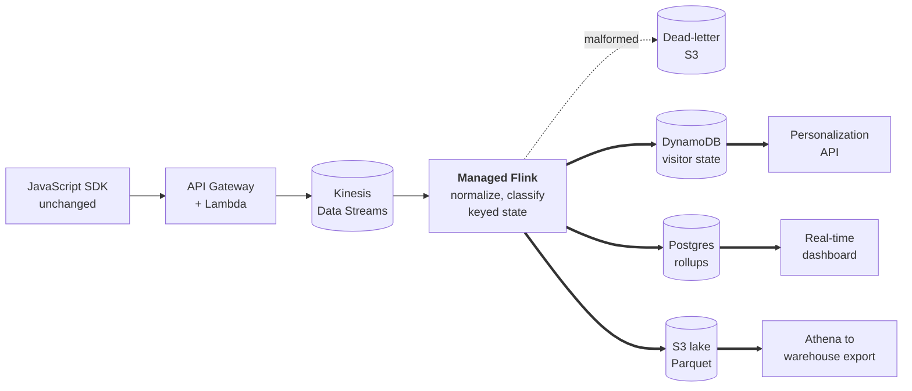

# Real-Time Analytics Pipeline: Engineer 004

**Brief version: 2026-07** | Henry Hai Nguyen
Fixture worked from: `fixtures/event_sample.jsonl`, SHA-256 [Observed]
`1aeb24b415009e89fcf8acb5a178410faf216dc17b16920d9849ecc8bbb24235`
Artifact: https://github.com/henry-hai/beat-claude-engineer-004

*4 pages of prose; diagrams excluded from the count per the brief.*

---

# Written answer

Every number here regenerates from `pipeline/run.py`, `pipeline/latency.py` and
`pipeline/cost.py`; outputs are committed in `results/*.json` [Observed].

<!-- BUDGET: ~2,400 words across this section. 4 pages max. Diagrams do not
     count toward the limit. Every paragraph containing a number must carry
     [Observed] / [Estimated] / [Benchmarked] / [Assumed] in that same
     paragraph - the pre-screen linter warns on bare figures.

     ASCII ONLY in this file. Windows PowerShell mangled em-dashes on a
     round-trip once already, and the linter hard-fails on invisible
     characters. The HTML converter handles typography at render time. -->

## Thesis: the risk is at ingest, not in the broker

Every answer to this brief will open by picking a broker. That is the least
interesting decision on the table. Kinesis, MSK and self-managed Kafka all move
bytes, all publish pricing, all carry an SLA. Any of the three would work here,
which is exactly why it is not where the risk lives. I still pick one below,
and the deciding reason turns out to be operational rather than technical.

What will hurt you is in the ingest path, and the sample data proves it. Three
events break a constraint the brief calls non-negotiable, and none look broken
at a glance [Observed], all traceable in `results/findings.json`:

- **`evt-0009`** uses an older SDK's field names (`timestamp`, `page_path`,
  `ref`, type `pageview`). Customers cannot be made to upgrade, so that shape
  is permanent. Reject it and a paying customer silently loses data.
- **`evt-0007`** carries a raw email and phone while `user_id` is null;
  **`evt-0022`** resolves that visitor to `u-7304` fifteen events later. And
  **`evt-0017`** demands GDPR deletion for `u-1077`, whose history includes
  **`evt-0006`**, written while anonymous. Delete by `user_id` and you miss it;
  an incomplete deletion is a regulatory failure, not a bug.
- **`evt-0011`** has no `tenant_id` [Observed]. Across 500 tenants, guessing is
  not a data quality issue; it is one customer seeing another's visitors.

So ingest is the component I built, ran, and measured.

## 1. Architecture and technology choices



**Figure 1.** SDK to dashboard. The dead-letter branch is drawn deliberately: a
malformed record must never stop the consumer.

### Why each component, and what was rejected

| Component | Chosen | Rejected | Deciding reason |
|---|---|---|---|
| Ingest | Kinesis Data Streams | MSK, self-managed Kafka | Modeled infrastructure is 3.6% of the ceiling [Estimated], so engineer-hours are scarcer than dollars. MSK is cheaper per byte and costs broker operations two engineers do not have. |
| Processing | Managed Flink | Lambda, ECS consumers | Four of the thirteen checks the detector performs cannot be answered from a single event [Observed]. Those need checkpointed keyed state, which a stateless consumer cannot provide at any price. |
| Visitor state | DynamoDB | Redis-only, Postgres | Single-digit-millisecond point lookups on the personalization path, per-tenant partition keys, no capacity planning. |
| Dashboard serving | Postgres rollups | ClickHouse, OpenSearch | The team already runs PostgreSQL. Aggregation happens upstream, so it stores summaries rather than raw events. Reversible; see the tripwire in section 3. |
| Event lake | S3 + Athena | Redshift | The brief requires export to Snowflake and BigQuery; Parquet on S3 is the neutral format both read. |
| Hot cache | ElastiCache Redis | none | Already in their stack. Segment membership, not raw events. |

Unit prices and per-component lines: `results/cost_model.json` [Benchmarked].

**The stateless/stateful split is the load-bearing choice.** Normalization and
per-event classification are pure functions of one event, so any worker can
process any record. Duplicate detection, burst detection, identity stitching and
deletion scope are not; they depend on what that worker has seen. That
boundary, not the broker, decides whether this needs Flink-class state: 9 checks
on one side, 4 on the other [Observed].

### Event structure and identity

One canonical envelope (`event_id`, `tenant_id`, `anonymous_id`, `user_id`,
`type`, `ts`, `received_at`, `properties`), with legacy names mapped at the edge
from a lookup table rather than in code, so registering the next SDK generation
is a config change. Every transformation is recorded, so the pipeline can always
answer *what did you change about this event?* `ts` is the browser's clock,
`received_at` is ours; both are kept and neither "corrects" the other.

**Identity resolves backwards.** A visitor browses anonymously, signs in, and
their earlier events become theirs retroactively. Four such stitches appear in
25 lines [Observed], including `anon-3d0` to `u-7304`, which retroactively attaches
`evt-0007`'s personal data to a named person. Deletion therefore runs against
the identity graph in durable storage, never the bounded in-memory window, which
returns a lower bound rather than the truth. See `pipeline/state.py`.

## 2. Scale, reliability and migration

### Sizing, and the number that changes the answer

50M events/day [Observed] is 579 events/second average, 5,787 at the stated 10x
spike [Estimated]. At the 229-byte mean event size measured on the fixture
[Observed], that peak is 1.33 MB/s.

A Kinesis shard gives 1 MB/s **or** 1,000 records/second [Benchmarked]. The
peak therefore needs 1.3 shards by bandwidth and 5.8 by record count
[Estimated]. **Record count binds.** A shard saturates its record limit while
using 23% of its bandwidth, so sizing on throughput under-provisions by roughly
4x. That is one plausible mechanism behind "crashes during traffic spikes."
Provisioned at
8 shards, 30% headroom [Assumed]; derivation in `results/cost_model.json`. That
result exists only because the event size was measured, not guessed.

### Zero loss, and what degrades first

Delivery is at-least-once, so dedupe keys on `(tenant_id, event_id)`, not
`event_id` alone, because SDKs do not coordinate IDs across customers and collapsing
them deletes one tenant's event on another's collision. `evt-0002` appears
twice, 7.4 seconds apart: a retry [Observed].

Unparseable records go to a dead-letter sink with bytes intact, never the floor.
`evt-0020` is one missing brace; the obvious consumer dies there and never reads
the four events after it [Observed]. Scale that to a crash-looping consumer
while the broker keeps accepting writes and you have the loss mechanism the
brief describes. Under overload the system sheds in a stated order and **ingest
never sheds**: rollup granularity coarsens, then personalization falls back to
cached segments, then lake writes batch larger. The broker is the buffer;
buffered data is late, not lost. See `pipeline/normalize.py`.

### Migration: per-tenant, with an automatic trigger

The SDK cannot change and 500+ customers cannot break [Observed], so no part of
the cutover is visible to them. API Gateway forks to both pipelines with the old
one authoritative; both process everything in parallel; shadow dashboards go
internal-only; then per-tenant cutover, smallest first. **"Accuracy verified"**
means, per tenant-hour: counts agree within 0.1% [Assumed] and an `event_id`
join leaves no unmatched rows on either side.

**The rollback trigger is automatic and needs no human.** Any tenant-hour
diverging more than 0.5% for two consecutive hours [Assumed], or dashboard p95
over 5 seconds, reverts that tenant and pages on-call. Rollback is per-tenant,
so a bad cutover costs one customer an hour rather than all of them. The
comparison runs the same code as `pipeline/rules.py` against both streams.

Two accuracy signals run continuously afterwards [Assumed]: the gap between
`evt-0019`'s client-side counter and the server's own record, which is a free
measurement of pipeline loss; and new instrumentation, a monotonic per-session
sequence number, because gaps in a server-assigned `event_id` cannot detect
loss at all. See section 5.

## 3. Trade-offs and risks

**Optimizing for** correctness you can audit and a system two engineers can
operate; **sacrificing** peak cost efficiency and, in the MVP, query
flexibility. Modeled infrastructure is $1,809/month, 3.6% of the ceiling
[Estimated] from [Benchmarked] AWS prices, and that survives every assumption
being wrong by 28x. **The $50K ceiling is not the binding constraint. Two
engineers and three months are.** That inverts the usual build-versus-buy call:
self-managed Kafka is cheaper per byte and spends the scarcer resource.

**The MVP excludes** a columnar serving tier, ML segmentation, per-tenant
retention, real-time backfill, and cross-tenant benchmarking.

**The serving tier is reversible, with a computed reversal condition.**
Dashboards come from pre-aggregated rollups in PostgreSQL, which this team
already runs. At the modeled shape that table holds 100M hot rows against an
assumed 250M ceiling: 40% utilization, 2.5x headroom [Estimated]. Three
conditions trigger a migration review: rows past the ceiling (leading),
dashboard p95 over 1s across 7 days, or rollup lag over 30s. An option held,
not a migration scheduled. It may never fire.

**With more time I would measure the per-tenant distribution first.** 50M/day
is a fleet-wide total [Observed]; 500 tenants at 100k is a different system
from 20 at 2M and 480 at 8k [Assumed], and which it is changes the serving
tier. Figures derive from `pipeline/cost.py`; the tripwire is in
`results/cost_model.json`.

## 4. What is actually in the sample data

**13 distinct anomaly classes across 25 lines**: 9 answerable from a single
event, 4 requiring memory of others [Observed]. Full output with every
`event_id` in `results/findings.json`.

| Class | Events | Pipeline response |
|---|---|---|
| Malformed JSON | `evt-0020` | Dead-lettered, bytes intact; consumer continues |
| Duplicate delivery | `evt-0002` | Dedupe on `(tenant_id, event_id)` before counting |
| Schema drift / no server clock | `evt-0009` | Normalized at the edge; `received_at` left null, never invented |
| Null tenant | `evt-0011` | Quarantined; never attributed by inference |
| Clock skew, 3 magnitudes | `evt-0005`, `-0006`, `-0016` | Ladder: 47s, 65min, 365d. Excluded from windowed math, not corrected |
| Far-future timestamp | `evt-0016` | Quarantined pre-windowing; would advance the watermark past every real window |
| Bot traffic | `evt-0012`-`-0015` | Two signals: referrer, and 4 events in 51ms. Quarantined, never deleted |
| PII in properties | `evt-0007` | Caught by key name and value shape; tagged for deletion tooling |
| Privacy request in-stream | `evt-0017` | Routed to the deletion workflow, not counted as behavior |
| Deletion scope | `evt-0017` | Resolved via identity graph; reaches `evt-0006`, written anonymously |
| Identity stitching | `evt-0003`, `-0008`, `-0017`, `-0022` | History re-attributed retroactively |
| Client-asserted aggregate | `evt-0019` | Stored with provenance, never source of truth. See section 5 |
| *all rows* | *25 lines* | *[Observed], regenerate via `pipeline/run.py`* |

**The 9/4 split is itself an architectural finding.** Those four cannot be
answered by a stateless consumer at any price. They are the argument for keyed
state, and why the detector separates them rather than hiding the boundary.

## 5. Three things I would not act on at face value

All three are reproducible against `results/findings.json`.

**1. The number the browser made up.** The brief asks for a "viewed pricing 3x"
segment. `evt-0019` supplies exactly that: `count_today: 3`. The server's own
record for that visitor, `anon-9f2`, shows **one** pricing page view
[Observed]. A counter computed in a browser cannot be audited, cannot be
recomputed, and is trivially forged. The trap is not spotting bad data. It is
that the brief asks for the feature the bad data would break. Segments are
recomputed server-side. The claim is still stored, in a separate namespace,
because the divergence is a free loss measurement.

**2. The bot cluster.** `evt-0012`-`evt-0015`: four page views in 51ms from one
visitor, all referred by a host containing "scanner" [Observed]. I flag and
quarantine; I do not delete. A referrer is attacker-controlled and legitimate
hosts contain that substring. Wrong and deleted, real customer data is gone
with no recovery; wrong and labeled, the cost is one column in a table.

**3. The brief's own loss figure.** It states ~3% loss at peak. This fixture
can neither confirm nor refute that, and I will not pretend otherwise.
`event_id` runs `evt-0001` to `evt-0024` with no gaps [Observed], but a
curated sample shows no gaps whether or not the system leaks, and we do not
know whether `event_id` is assigned client-side or on receipt. If the server
assigns it, loss is invisible by construction. **What would settle it:** a
monotonic per-session sequence number, emitted by the SDK and reconciled
server-side. That is why it is in week-one scope rather than a "we would
monitor this" sentence.

---

# Operating artifact

A runnable ingest-validation pipeline in pure Python 3, standard library only.
No dependencies, no Docker, no network. It is the prototype of the component
argued above to be the riskiest, and it doubles as the ingest stage of the
design rather than being a separate demo.

Four modules, split along how stream processors actually execute work:
`normalize.py` (stateless map), `rules.py` (stateless classify), `state.py`
(keyed aggregate over a window), `run.py` (job graph and sinks). Everything in
the first two is a pure function of one event and lifts into production
unchanged; everything that could not satisfy that contract was pushed into
`state.py` rather than smuggled in.

Every number in this document regenerates from these three commands:

```
python -m pipeline.run     fixtures/event_sample.jsonl
python -m pipeline.latency fixtures/event_sample.jsonl
python -m pipeline.cost
```

Outputs are committed to `results/`, so findings are readable without running
anything. 50 tests [Observed]: `python -m unittest discover -s tests -t .`

# Artifact access

**https://github.com/henry-hai/beat-claude-engineer-004**. Public, verified
reachable unauthenticated. `git log` is the build history in order.

```
git clone https://github.com/henry-hai/beat-claude-engineer-004
cd beat-claude-engineer-004 && python -m pipeline.run fixtures/event_sample.jsonl
```

The fixture is vendored so the repo runs standalone, and `.gitattributes` pins
`*.jsonl` with `-text` so Git never rewrites its line endings. Without it,
cloning on Windows converts 25 line endings to CRLF and moves the file from
5,749 to 5,774 bytes: identical text to a human, a completely different
SHA-256 [Observed]. GitHub serves 5,749 bytes, so `shasum -a 256` reproduces
the hash at the top of this document on any platform.

# Evidence log

Tiers per SCORING.md. Every figure is [Observed] unless the row says otherwise.

| Claim | Tier | Check it |
|---|---|---|
| 13 anomaly classes, 21 findings, every `event_id` cited | 3 | `results/findings.json` |
| Fixture checksum reproduces on any OS | 3 | `shasum -a 256 fixtures/event_sample.jsonl` |
| Mean event size 229 bytes, median 228, range 200-285 | 3 | `results/cost_model.json` |
| Batch vs streaming staleness: 481.9s vs 0.164s median | 3 | `results/latency.json`, method in `pipeline/latency.py` |
| Per-event processing 0.017ms mean | 3 | `results/latency.json` |
| Record count binds Kinesis sizing, not bandwidth | 3 | `results/cost_model.json` |
| Modeled spend $1,809/mo, 3.6% of ceiling, AWS prices dated | 3 | `results/cost_model.json` |
| Serving tripwire: 100M hot rows vs 250M ceiling | 3 | `results/cost_model.json` |
| Build history and decision record | 3 | `git log`, 16 commits with reasoning |
| Architecture and rejected alternatives; 50-test suite | 2 | this document; `tests/` |
| **Measured before/after from a comparable production system** | **none** | **I do not have this** |
| *every figure above* | *3* | *[Observed] via `results/*.json`* |

**On the missing Tier 4.** The rubric calls it the differentiator: measured
before/after from a comparable system actually built or fixed. I have no
production pipeline at this scale to cite, so I am not claiming it. The closest
honest substitute is the latency harness in `pipeline/latency.py`, logged Tier 3
deliberately, because it is a benchmark run on a simulation I wrote, moving 25
events rather than 50 million [Observed]. Calling it Tier 4 would be inflation on a rubric
built to catch exactly that.

# Number source labels

Every number carries one of four labels, in the same paragraph.
**[Observed]**: measured from the fixture or from running the artifact,
reproducible with the commands above. **[Benchmarked]**: a published AWS list
price, with page and retrieval date recorded in `pipeline/cost.py`.
**[Estimated]**: derived by stated arithmetic from labeled inputs, with the
derivation in the code rather than just the conclusion. **[Assumed]**: a
placeholder chosen to make the plan concrete. Every threshold in the detector
and every sizing assumption in the cost model is [Assumed] and lives as a named
constant, easy to find and argue with rather than buried in a function.

# AI usage disclosure

**Tools.** Claude Code (Opus 5) in a terminal for the build; a separate Claude
browser session as an adversarial reviewer.

**What AI did.** Wrote the pipeline code, the cost model, and a first draft of
this document from my direction. Pulled AWS list prices from published pages.
Caught the line-ending problem that would have made my checksum unreproducible.

**What I decided.** That the fixture detector was the primary artifact and the
broker POC optional. That the riskiest component is ingest, not transport. That
my own prior work stays out of the evidence log, so every claim here is
reproducible by a stranger. The voice. What the MVP excludes.

**What I checked or changed.** Every number was regenerated from the artifact,
not transcribed. Two AWS components could not be priced from the published
pages; rather than let a plausible figure through, I left them visibly
unpriced. I used the second session to attack the first, and it correctly
called out that I had claimed Tier 4 for the latency measurement when the
rubric does not support it, hence Tier 3. Two model-generated numbers were
wrong and caught by re-running the arithmetic; the rollup sizing used a
cross-product where the real bound is traffic, which would have selected the
wrong serving tier.

**Known weak spots.** The prose is fluent, and fluency is not evidence. Judge
the repo, not the writing. Every threshold is [Assumed] rather than tuned
against real data; they are named constants in `pipeline/rules.py` and
`pipeline/state.py`, easy to find and argue with. I have not operated Kafka or
Flink in production; this is reasoned from first principles and from the
failure modes visible in the fixture, not from having run one at 50M
events/day.

# What breaks it

**The sample is 25 events** [Observed]. It cannot establish any rate: not
error, not loss, not a distribution. Every conclusion from it is about
mechanism, not magnitude.

**Every threshold is assumed**: clock-skew tolerances, the dedupe window, the
burst threshold, the Postgres row ceiling. If real skew across the SDK fleet is
distributed differently than guessed, the ladder mislabels events.

**The bot heuristic has false positives** by construction: a referrer is
attacker-controlled and a legitimate company could be called anything. Which is
why the pipeline labels rather than deletes.

**Deletion scope from the artifact is a lower bound.** Keyed state is bounded,
so the in-memory graph knows only what it has recently seen. Real deletion runs
against durable storage.

**Two cost lines are unpriced**, a managed OLAP tier and Aurora, because AWS
did not render their rate tables when checked. With 96% of the ceiling unused
[Estimated] they are unlikely to change the conclusion, but that is a
prediction, not a calculation.

**The per-tenant distribution is unknown**, and it decides the serving tier. If
the fleet is 20 large tenants rather than 500 even ones [Assumed],
the Postgres rollup table is wrong from day one and the tripwire fires
immediately rather than never.

**The latency harness is a simulation.** It has no network, no cluster, no
queue. It isolates and measures one mechanism: batch-window size
dominates end-to-end latency. It proves nothing about any broker. Method and
exclusions are stated in `pipeline/latency.py`.

# What stays human

Everything below is irreversible or legally binding. The detector labels rather
than acts, precisely so these stay decisions.

**Deleting suspected bot traffic.** Automated flagging, human deletion. Wrong
and deleted, there is no recovery; wrong and labeled, the cost is one column.
Asymmetric risk means the automation stops at the flag.

**The scope of a GDPR deletion.** The pipeline can compute which anonymous
history belongs to an identified user; it should not execute unreviewed. Both
errors are unacceptable in different directions. Too little is a regulatory
failure; too much destroys another person's data.

**Overriding a rollback.** The rollback is automatic and needs no human; that
is the point. Pushing a tenant forward again after one fires is a judgment
about whether the cause is understood.

**Attributing a null-tenant event.** `evt-0011` has no tenant [Observed].
Guessing which of 500+ customers owns it is a data breach if wrong, so the
pipeline quarantines and a human resolves it against the source integration.

**Declaring accuracy verified at cutover.** The parallel run produces a number.
Deciding it is good enough to move a paying customer is not a threshold check;
it is accountability, and it needs a name attached.

**Tuning any threshold here.** Every one is [Assumed]. Changing them changes
what the pipeline considers real, and that is never an autoscaling decision.
